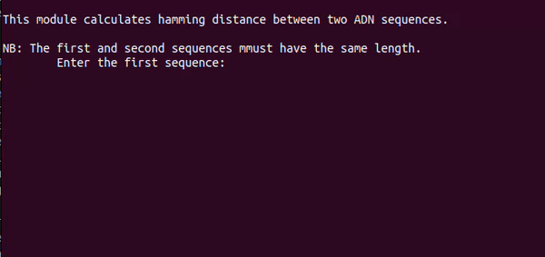

Here are some modules of bioinformatics written in python.  
Make sure you've python installed on your machine to execute them i.e it's accessible through the terminal.

## Installation and run module

Open a terminal or command prompt and navigate to the directory that you want to store the repository on your machine.
- Clone the repository:
```
    git clone https://github.com/Nick-Kevin/Bioinformatics-in-Python.git
```
- Change the directory to the new folder:
```
    cd Bioinformatics-in-Python
```
- Run module: now you have to run moudules  
 eg:
```
    python hamming_distance.py
```
 or
```
    python3 hamming_distance.py
```

### List of modules
- [Hammming distance](#hamming-distance)
- [Levenshtein distance](#levenshtein-distance)
- [Nearest Neighbor Networks (NNN)](#nearest-neighbor-networks-nnn)

### _Hamming distance_
Hamming distance is a metric for comparing two binary data strings or strings data. While comparing two binary strings of equal length, Hamming distance is the number of bit positions in which the two bits are different.
But here, the bit is replaced by character because of comparing two ADN. 

The Hamming distance between two strings, a and b is denoted as d(a,b).
#### overview


### Levenshtein distance
Levenshtein distance is a well-established mathematical algorithm for measuring the edit distance between words and can specifically weight insertions, deletions and substitutions. However, there are drawbacks to using Levenshtein distance in a biological context and hence has rarely been used for this purpose.  
The Levenshtein distance allows deletion, insertion and substitution. The Hamming distance allows only substitution, hence, it only applies to strings of the same length.
#### overview


### _Nearest Neighbor Networks (NNN)_
Nearest Neighbor Networks (NNN), a graph-based algorithm to generate clusters of genes with similar expression profiles. This method produces clusters based on overlapping cliques within an interaction network generated from mutual nearest neighborhoods. This focus on nearest neighbors rather than on absolute distance measures allows us to capture clusters with high connectivity even when they are spatially separated, and requiring mutual nearest neighbors allows genes with no sufficiently similar partners to remain unclustered.
It uses the levenshtein distance to calculate distances between each ADN sequence and classe and classify each ADN sequence.
#### overview
